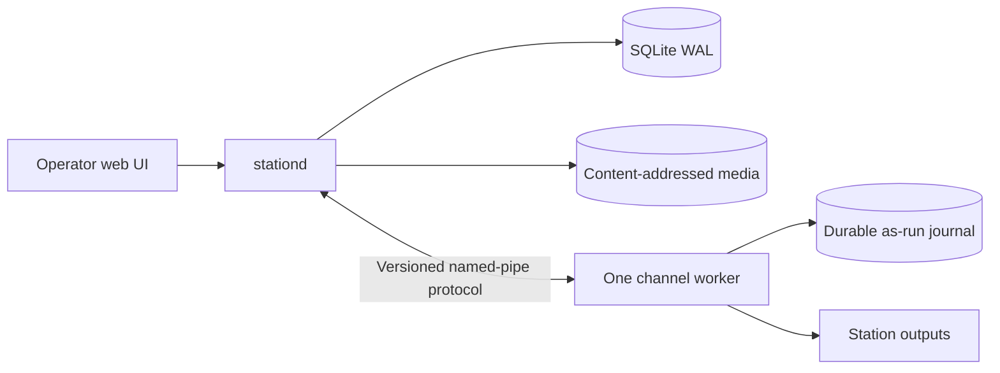

# Architecture overview

TownLight Station is a Windows appliance with local authority. Internet services may extend it, but loss of the Internet cannot take a commissioned channel off air or destroy its operating record.

## Runtime boundaries



`stationd` is a modular monolith and the only writer to the authoritative station database. A separate persistent worker owns each channel's GStreamer graph, media clock, output switching, and append-only as-run journal. File processing and optional local AI run outside both timing-critical and authoritative paths.

On an installed station, Windows Service Control Manager owns the `stationd` process. Service startup requires an absolute database path and a loopback HTTP address. The process reports start-pending, running, stop-pending, and stopped states; both an operator stop and operating-system shutdown drain through the same cooperative API stop signal. See [ADR 0005](../adr/0005-native-windows-service.md).

One elevated setup executable carries the station binaries and a private, hash-pinned media runtime. Activation precedes formal product registration and must reach SCM running state plus HTTP/database readiness; otherwise staged resources are rolled back and setup returns nonzero. Uninstall removes executable state but preserves the authoritative station database. See [ADR 0006](../adr/0006-health-gated-windows-installer.md).

The initial control-plane dependency direction is enforced by the Cargo workspace:

```text
station-domain <- station-storage <- station-api <- stationd
```

The domain crate has no storage, HTTP, media, or Windows-service dependencies. Storage translates domain objects to SQLite. The API owns transport and error contracts. The daemon is composition and process lifecycle only.

`station-media-protocol` is independent of the control-plane crates. It defines bounded length-prefixed command and event envelopes, explicit protocol versions, command identifiers, expected worker sequences, and durable event sequences. See [ADR 0001](../adr/0001-media-worker-protocol.md).

`station-media-journal` owns the append-only per-channel record. `channel-worker` is its sole writer. Every record has a journal magic/version header, bounded length, CRC-32 checksum, worker/channel identity, and strict monotonic event sequence. Writes are flushed and synchronized before the corresponding event is emitted. Restart scans the complete journal and resumes at the next sequence; corruption and partial tails prevent a false clean recovery. See [ADR 0002](../adr/0002-durable-channel-journal.md).

`station-windows-ipc` owns the local control boundary. Each worker connects to one duplex byte-mode named pipe beneath `\\.\pipe\townlight-station\`. Pipe creation rejects duplicate servers and remote clients, and applies a protected ACL limited to SYSTEM, Administrators, and the creating user. Commands and events use the same versioned frames; standard input and output are not protocol transports.

`station-runtime` owns worker process lifecycle from the station side. It creates the exclusive pipe, launches the worker without inherited protocol handles, bounds connection and response waits, accepts only the configured worker/channel identity and next sequence, requires a durable `Ready` handshake, and terminates and reaps the child on every failed launch, timeout, or abandoned session. Clean shutdown is complete only after `ShutdownComplete` and a successful process exit. See [ADR 0003](../adr/0003-supervised-worker-lifecycle.md).

`station-media-assets` owns the admission boundary for file bytes. It discovers real stream metadata, requires finite A/V, atomically copies and synchronizes the source into a SHA-256-addressed library object, revalidates the stored copy, and treats duplicate content as the same asset. See [ADR 0007](../adr/0007-content-addressed-media-ingest.md).

`station-media-engine` owns the GStreamer graph. It builds all elements through factories and leaves OpenH264, AAC, the parsers, `mpegtsmux`, and UDP output in one persistent graph across switches. A validated stored asset can be decoded and added while fallback remains on air. Preparing the next asset uses generation-scoped elements; only after the new leg is ready does it become the program target, after which the retired decoder is disconnected, stopped, awaited in `NULL`, and removed. File pads receive the running pipeline offset, both selectors feed single continuous timelines, and video/audio rate adjusters prevent boundary jitter. The Windows machine test validates the actual transport stream across two distinct real assets and both fallback returns. See [ADR 0004](../adr/0004-persistent-gstreamer-graph.md).

## Authority rules

| Truth | Owner |
|---|---|
| Configuration, users, assets, schedules, jobs | `stationd` through SQLite |
| Media bytes | Content-addressed NTFS store |
| Current on-air execution | Channel worker |
| What actually aired | Durable per-channel journal |
| Installed version | Signed candidate and installation receipts |

## Product languages

Rust is used for native services, workers, command-line tools, and installation infrastructure. TypeScript and React are used for browser interfaces. Apple, Android, Roku, and web resident clients use their platform-native production toolchains.

## Non-negotiable decisions

- One canonical repository produces one candidate identity.
- SQLite WAL is the local authority; no database server is installed.
- Every channel has one persistent GStreamer production engine.
- FFmpeg may perform bounded file work but never linear playout.
- Media workers cannot write the station database.
- On-air events are journaled durably before they are acknowledged.
- Configuration is typed and audited; environment variables are development bootstrap only.
- Updates use signed immutable slots, health deadlines, and rollback.
- A capability is not complete until its installed-machine scenario passes.

## Current vertical slice

The current spine installs from one setup executable, runs under Windows Service Control Manager, commissions a station profile through `PUT /api/v1/station`, protects updates with an expected revision, persists it transactionally in SQLite with WAL and foreign-key enforcement, reads it after restart, and exposes database readiness through `GET /health`. Machine proofs cover native service lifecycle; failed installer rollback; clean install with a private GStreamer runtime; installed binary/receipt integrity; uninstall that removes the service and application while preserving station data; and reinstall that recovers the same commissioned profile and revision.

The first channel worker now runs as an independent supervised process and owns its persistent GStreamer graph. Durable `Ready` follows successful fallback output startup; durable `AssetLoaded` follows identity verification and dynamic decode readiness; durable `OnAirChanged` follows an acknowledged asset or fallback transition; durable `ShutdownComplete` follows graph shutdown. The supervisor drives two distinct ingested files on air in sequence and proves the entire event sequence survives worker restart. Schedule-time dispatch, live inputs, profile-driven output, and `stationd` channel configuration are the next media milestones.
