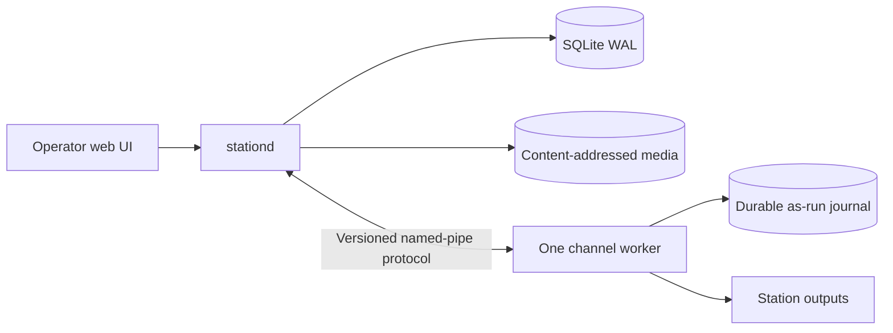

# Architecture overview

TownLight Station is a Windows appliance with local authority. Internet services may extend it, but loss of the Internet cannot take a commissioned channel off air or destroy its operating record.

## Runtime boundaries

`stationd` is a modular monolith and the only writer to the authoritative station database. A separate persistent worker owns each channel's GStreamer graph, media clock, output switching, and append-only as-run journal. File processing and optional local AI run outside both timing-critical and authoritative paths.

## Authority rules

| Truth | Owner |
|---|---|
| Configuration, users, assets, schedules, jobs | `stationd` through SQLite |
| Media bytes | Content-addressed NTFS store |
| Current on-air execution | Channel worker |
| What actually aired | Durable per-channel journal |
| Installed version | Signed candidate and installation receipts |

## Product languages

Rust is used for native services, workers, command-line tools, and installation infrastructure. TypeScript and React are used for browser interfaces. Apple, Android, Roku, and web resident clients use their platform-native production toolchains.

## Non-negotiable decisions

- One canonical repository produces one candidate identity.
- SQLite WAL is the local authority; no database server is installed.
- Every channel has one persistent GStreamer production engine.
- FFmpeg may perform bounded file work but never linear playout.
- Media workers cannot write the station database.
- On-air events are journaled durably before they are acknowledged.
- Configuration is typed and audited; environment variables are development bootstrap only.
- Updates use signed immutable slots, health deadlines, and rollback.
- A capability is not complete until its installed-machine scenario passes.

## Current vertical slice

The first slice commissions a station profile through `PUT /api/v1/station`, persists it in SQLite with WAL and foreign-key enforcement, reads it after restart, and exposes database readiness through `GET /health`. It establishes the API-to-domain-to-storage path that subsequent commissioning capabilities will extend.
